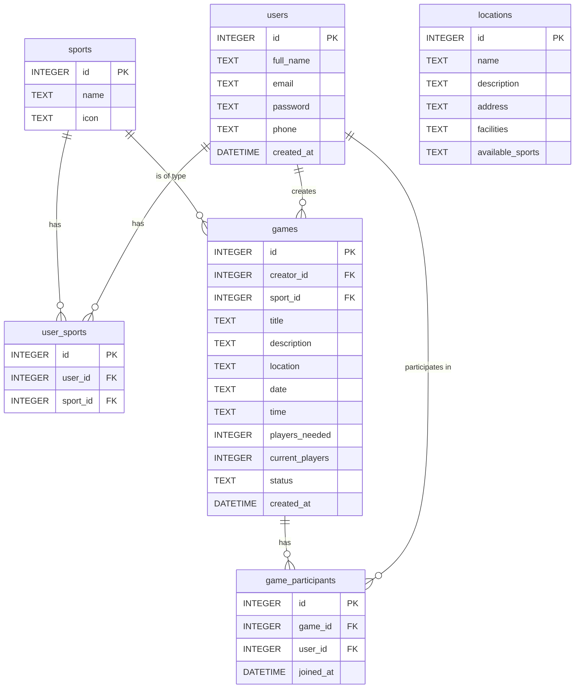
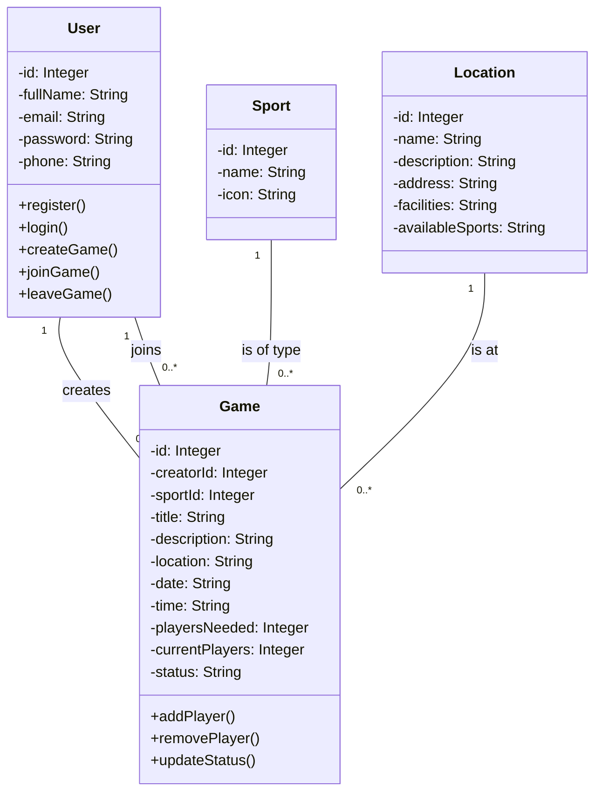
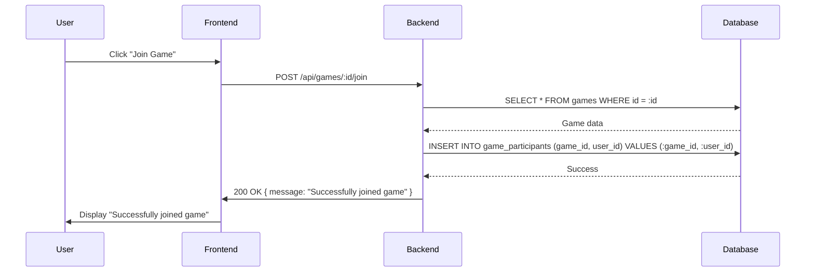
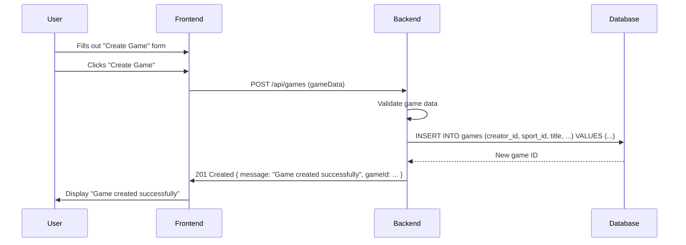

# System Diagrams

This document contains the sequence, class, and ER diagrams for the e-commerce system.

## ER Diagram

## Class Diagram

## Sequence Diagrams

### Join a Game

### Post a Game

